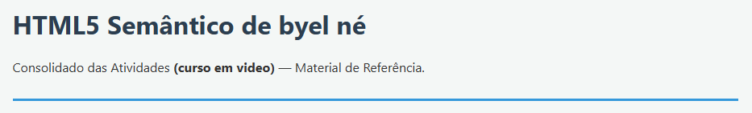

<h1>O que o projeto faz?</h1>
Este projeto é um guia de referência pessoal e prático contendo o consolidado das atividades e conceitos aprendidos no curso de Front-End (Curso em Vídeo). O objetivo é centralizar os fundamentos de semântica, mídias e estilização em uma única página scannável.

<h2>1. Estrutura e Semântica HTML5</h2>
Hierarquia de Títulos: Organização correta de &lt;h1&gt; a &lt;h6&gt;.

Formatos de Texto: Aplicação real de &lt;strong&gt;, &lt;em&gt; e &lt;mark&gt;, além de elementos técnicos como &lt;sub&gt; e &lt;sup&gt;.

Tags de Layout: Divisão estrutural usando &lt;header&gt;, &lt;nav&gt;, &lt;main&gt;, &lt;aside&gt; e &lt;footer&gt;.

<h2>2. Mídias e Responsividade</h2>
Imagens Dinâmicas: Uso da tag &lt;picture&gt; com media e srcset para carregar imagens responsivas.

Áudio e Vídeo Locais: Implementação de players nativos com as tags &lt;audio&gt;, &lt;video&gt; e &lt;source&gt;.

Vídeos Externos: Incorporação via tag &lt;iframe&gt; diretamente do YouTube.

<h2>3. Links e Atributos Avançados</h2>
Comportamento: Diferença entre links internos e externos utilizando a tag &lt;a&gt;.

Atributo rel: Guia de segurança, SEO e performance aplicado ao atributo rel.

Downloads: Utilização do atributo download para baixar arquivos direto do navegador.

<h2>4. Estilização (CSS3)</h2>
<ul style="disc">
  <li>Tipografia: Importação de fontes externas e inclusão de fontes locais via regra @font-face.</li>
  <li>Shorthands: Otimização de código combinando propriedades de declaração rápida.</li>
  <li>Seletores e Estados: Demonstração prática de seletores e comportamento de pseudo-classes.</li>
  <li>Box Model: Divisão estrutural entre conteúdo, espaçamento, borda e margem.</li>
</ul>
<h2>Tecnologias Utilizadas</h2>
<ul>
<li>HTML5 (Foco em semântica e acessibilidade)</li>
<li>CSS3 (Arquitetura de caixas, fontes e estados)</li>
<li>Google Fonts (Fontes externas integradas)</li>
</ul>
